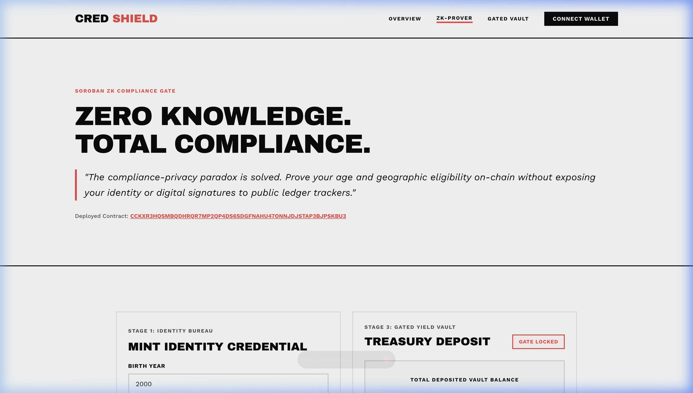
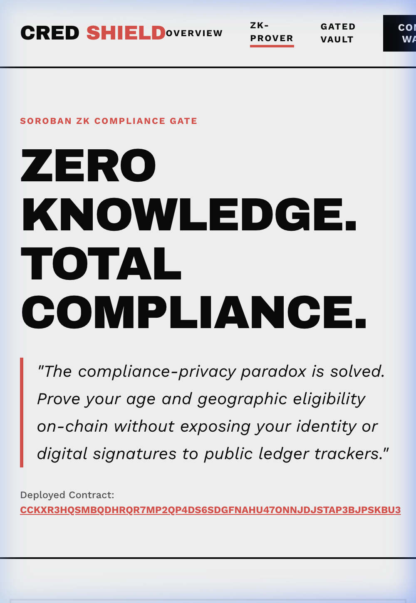
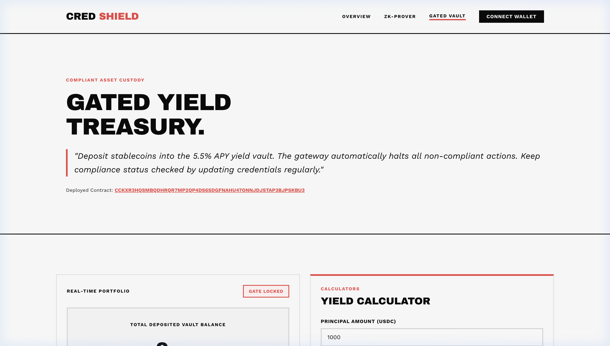

# Stellar CredShield

**Stellar CredShield** is a privacy-preserving DeFi custody portal and yield vault gated by zero-knowledge compliance logic on the Stellar Testnet. It is built using Soroban smart contracts, Freighter Wallet, and a bold print-magazine **VoiceBox** design aesthetic.

---

## ⚡ Key Features

1. **Compliance Gated DeFi Vault:** Yield custody vault (5.5% APY) that programmatically locks or unlocks operations based on user compliance status verified on-chain.
2. **On-Chain Zero-Knowledge Logic:** Validates KYC criteria (Age ≥ 18, country of residence is valid) without revealing sensitive identity attributes publicly on the ledger.
3. **Freighter Wallet v2 Integration:** Silent connection checks on page load to eliminate unsolicited wallet prompts and pop-ups.
4. **Stellar Testnet Integration:** Verify credentials, mint mock identity bureau signatures, request Friendbot funding (10K XLM), and execute deposits/withdrawals directly on-chain.

---

## 📂 Project Structure

```text
├── app/                  # Next.js web application pages
│   ├── overview/         # Protocol explanation & details
│   ├── vault/            # Gated Yield Vault dashboard
│   ├── globals.css       # VoiceBox design token stylesheet
│   └── page.tsx          # ZK Prover & credential minting dashboard
├── contracts/            # Soroban Smart Contracts
│   └── credshield/       # Main CredShield contract (Rust)
│       └── src/lib.rs    # Verification, vault logic, and unit tests
├── lib/                  # Frontend helpers and pipelines
│   └── stellar.ts        # Soroban RPC client & Freighter integration
├── scripts/              # Setup and deployment scripts
│   └── deploy.js         # Rust cargo builder and contract deployment helper
└── package.json          # Dependency manifest
```

---

## 🚀 Quickstart

### Prerequisite

- Install [Node.js](https://nodejs.org/) (v18+)
- Install [Rust & Cargo](https://rustup.rs/) (v1.75+)
- Install the [Freighter Wallet Browser Extension](https://www.freighter.app/)

### 1. Install Dependencies

Install Node modules:

```bash
npm install
```

### 2. Configure Local Environment

Create a `.env` file in the root directory:

```env
NEXT_PUBLIC_SOROBAN_RPC_URL="https://soroban-testnet.stellar.org"
NEXT_PUBLIC_HORIZON_URL="https://horizon-testnet.stellar.org"
NEXT_PUBLIC_SOROBAN_CONTRACT_ID="CCKXR3HQSMBQDHRQR7MP2QP4DS6SDGFNAHU47ONNJDJSTAP3BJPSKBU3"
```

### 3. Run Dev Server

```bash
npm run dev
```

Visit [http://localhost:3000](http://localhost:3000) to view the portal.

---

## 🧪 Testing and Verification

### Rust Smart Contract Unit Tests

Run the Soroban contract test suite verifying age verification logic, sanctioned region restrictions, and vault gate locking:

```bash
cargo test --manifest-path contracts/credshield/Cargo.toml
```

### Next.js Production Build

Verify TypeScript compilation and page optimization:

```bash
npm run build
```

---

## ⛓️ On-Chain Deployment Details

- **Testnet Contract Address:** `CCKXR3HQSMBQDHRQR7MP2QP4DS6SDGFNAHU47ONNJDJSTAP3BJPSKBU3`
- **Deploy Transaction Hash:** `d3326c0c0fb3939a056f93672c77578dca7801f2802ce2a2a7c17c389634d8b2`
- **Verifiable on Stellar Explorer:** [Stellar.Expert View](https://stellar.expert/explorer/testnet/tx/d3326c0c0fb3939a056f93672c77578dca7801f2802ce2a2a7c17c389634d8b2)
- **Live Demo Link (Vercel):** [https://treasury-vault-six.vercel.app](https://treasury-vault-six.vercel.app)

---

## 🛠️ Submission & Verification Checklist

### 1. CI/CD Status & Build Verification
[](https://github.com/Atharvashind/credshield/actions)

The GitHub Actions workflow automates Rust smart contract test verification and Next.js production builds.

### 2. Test Output (4 Passing Unit Tests)
```text
running 4 tests
test test::test_compliance_rejected_under_age - should panic ... ok
test test::test_gated_vault_rejects_non_compliant - should panic ... ok
test test::test_compliance_rejected_sanctioned - should panic ... ok
test test::test_initialize_and_compliance ... ok

test result: ok. 4 passed; 0 failed; 0 ignored; 0 measured; 0 filtered out; finished in 0.06s
```


### 3. Interactive UI Screenshots

#### Desktop Portal View


#### Mobile Responsive UI Layout


#### Yield Vault Dashboard


